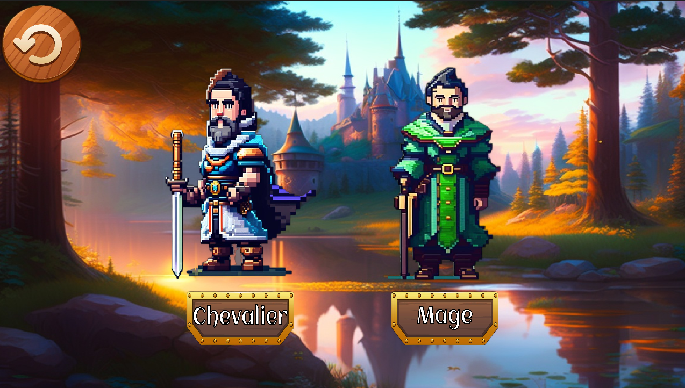
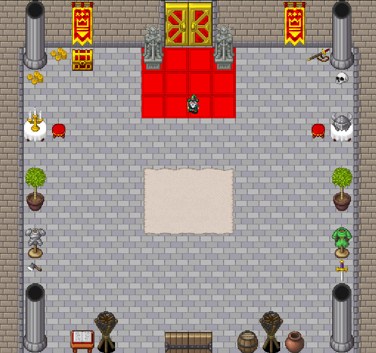
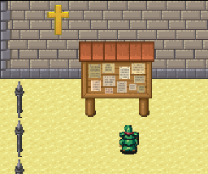
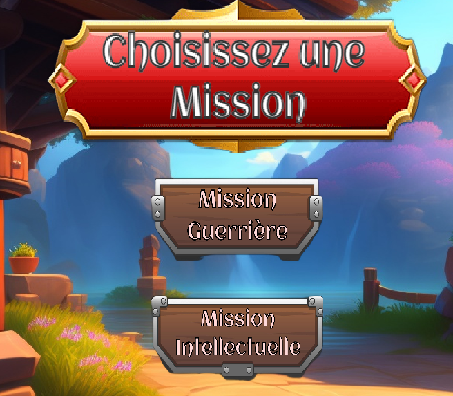

# Terminale_Jeux_Python
Il s'agit d'un projet de création d'un jeu sur pygame fait par des étudiants en terminale spécialité NSI au lycée Notre-Dame de Bellegarde (2022-2023).

## Le jeu

### Introduction au jeu
Il s'agit d'un jeu qui implémente deux sprites sur deux types d'interface : une interface brute et une interface "Tiled".

### But du jeu

Vous devrez vous rendre au menu des quêtes. Pour cela, vous aurez la possibilité de choisir votre personnage.

Rendez-vous ensuite à la salle du trône en passant par la gauche de l'écran.

Sortez ensuite par le sud et rejoignez le panneau des quêtes qui vous mènera au menu des quêtes.

C'est l'heure du combat ! Seule la mission guerrière est implémentée. Si vous êtes curieux, référez vous aux archives qui correspondent en partie à la mission intellectuelle qui a été retirée du jeu car elle ne fonctionnait pas correctement.

### Les commandes du jeu

**Q** -> Aller vers la gauche.
**Z** -> Aller vers la droite.
**S** -> Aller en bas.
**D** -> Aller en haut.

Sur la mission guerrière :
**ESPACE** -> Lancer un projectile.

### Installation du jeu
#### Windows
Il suffit de télécharger le code et de l'ouvrir sur un IDE tel que Visual Studio Code ou PyCharm par exemple. A priori les chemin sont absolue.

Il faut ensuite s'assurer d'avoir bien installé python.

Enfin, il faut installer les trois dépendances suivantes (à l'aide d'un **pip install** par exemple):
- pygame
- pytmx
- pyscroll

Lancez le code à partir du fichier Main.py

### Linux
En fonction de votre distribution linux, la manipulation n'est pas la même. En premier lieu, essayez la manipulation windows.

Si cela ne fonctionne pas à cause du blocage du pip install (comme c'est le cas sur Ubuntu à partir d'une certaine version), il faudra créer un environnement virtuel.

Pour ce faire, exécutez les commandes suivantes dans un terminal: 

- **1 : Se placer dans le bon répertoire :**

cd ~blabla/ (bien penser à modifier le chemin pour que cela fonctionne)

- **2 : Créer l'environnement virtuel :**

python3 -m venv venv

- **3 : Activer l'environnement virtuel :**

source venv/bin/activate

- **4 : Mettre à jour pip :**

pip install --upgrade pip

- **5 : Installer les dépendances :**

pip install pygame pytmx pyscroll

- **6 : Lancer le script python :**

python3 Main.py

Notez que si vous souhaitez désactiver l'environnement virtuel, il suffit d'utiliser la commande "**deactivate**"

## Crédits
- PHILIPPE Teva
- ANDRIOLETTI Thomas
- MOLL Johann